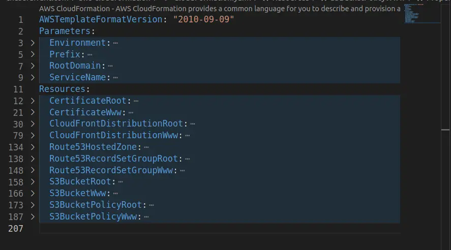

# {{ title }}
_date created: {{ date_created }}_ \
_last updated: {{ date_updated }}_


&nbsp;
## Introduction 
CloudFormation is an infrastructure-as-code service created by AWS. I have worked with CloudFormation for several years now, so here is a list of tips and tricks I've compiled that will take your templates to the next level. Many of these can also be applied to other IaC solutions such as Terraform, CDK, or even Azure ARM templates!


&nbsp;
## Use YAML
I used JSON for ___YEARS___ and didn't see a need to switch. I was comfortable with it, so why switch? However, I recently ran into a few situations that changed my mind. Here are some of the benefits of using YAML (based on facts, not opinions):

- __Supports comments__ - I find it baffling that comments were removed from the JSON spec.  
- __Smaller filesize__ - Although it's rare to hit, CloudFormation templates do have a file size limit. Using YAML significantly increases this limit.
- __Much easier to write inline scripts__ - No more escaping strings! This is huge for user-data scripts and CloudFormation hooks.


&nbsp;
## Tag resources during stack deployment
Most AWS resources support the concept of tags. However, declaring tags for each resource in a template is time-consuming and redundant. Surely there is a better way? Lo and behold! We can tag every resource within a template at the stack level during deployment. Use the CloudFormation Parameters file to also pass in tags at the stack level:

```json
{
    "Parameters": {
        "Environment": "prod",
        "Prefix": "cf"
    },
    "Tags": {
        "BusinessUnit": "Engineering",
        "Environment": "prod",
        "Owner": "TeamBlue"
    }
}
```

Now pass in the parameters file with the `--parameter-overrides` flag. Unfortunately, the parameters file doesn't yet support YAML :/

`aws cloudformation deploy --template-file demotemplate.yaml --s3-bucket demobucket --stack-name demostack --parameter-overrides file://demoparams.json`


&nbsp;
## Use the `aws cloudformation package` command
The `aws cloudformation package` command is a template preprocessor that allows local file references to be used within a template. The command converts local file references to external S3 URLs that the CloudFormation template can then reference during deployment. See the [documentation](https://docs.aws.amazon.com/cli/latest/reference/cloudformation/package.html) for more information.


&nbsp;
## Use mappings to standardize region names
Region names are variable in length and can be unnecessarily long. This can be frustrating if you need to include the region in a resource name but then subsequently hit a length limit.

CloudFormation mappings can be used to standardize the length and format of region names. By removing the dashes and truncating the length to 5, we can create a short and simple name for each region that is easy to understand without losing any information. This also enables parsing by the name by length or via '-' dashes if needed.

```yaml
---
AWSTemplateFormatVersion: "2010-09-09"
Mappings:
  RegionMap:
    ap-southeast-1:
      NameShortened: apse1
    ap-southeast-2:
      NameShortened: apse2
    ap-southeast-3:
      NameShortened: apse3
    ca-central-1:
      NameShortened: cace1
    us-east-1:
      NameShortened: usea1
    us-east-2:
      NameShortened: usea2
    us-gov-east-1:
      NameShortened: ugea1
    us-gov-west-1:
      NameShortened: ugwe1
    us-west-2:
      NameShortened: uswe2
Resources:
  - S3BucketDemo:
    Type: AWS::S3::Bucket
    Properties:
      Name: !Sub
        - demo-{RegionShortened}
        - RegionShortened: !FindInMap
            - RegionMap:
            - !Ref AWS::Region
            - NameShortened          
```


&nbsp;
## How to name CloudFormation resources
First, understand that there are two names associated with each resource in a CloudFormation template:

```yaml
---
AWSTemplateFormatVersion: "2010-09-09"
Resources:
  Route53HostedZoneCF:  # Logical Name
    Type: AWS::Route53::HostedZone
    Properties:
      Name: chasefarrant.com  # Physical Name
```

### __Physical Name__ - The name of the resource within AWS.
It's a common trope in software development - _naming things sucks._ Luckily for us, CloudFormation supports auto-generating the Physical Name for most resources! A major benefit to this approach is that CloudFormation can automagically replace resources without manual intervention. It simply creates a new resource with a _slightly different_ name alongside the old resource before deleting it. __TL;DR__ Don't use physical names if you can help it.

### Logical Name - The name of the resource _within_ the CloudFormation template.
The preferred format for the Logical Name is to use the `Service Name` and `Resource Type` at the beginning of the string combined with a unique `Name` at the end describing the resource's purpose. The unique name distinguishes it from other resources within the template and makes it easier to make changes down the road. Sometimes the `Service Name` can be omitted when it's redundant or misleading. Ex: `AWS::EC2::VPC` could just be `Vpc`.

- Service Name: _Dynamodb_
- Resource Type: _Table_
- Unique Descriptive Name: _Demo_
- __Final Name__: ___DynamodbTableDemo___

```yaml
---
Resources:
  DynamodbTableDemo: # {ServiceName}{ResourceType}{UniqueDescriptiveName}
    Type: AWS::Dynamodb::Table
    ...
```


&nbsp;
## Use lowercase characters and hyphens for stack names
Resources within the template will likely derive their name from the stack name, therefore the stack name should abide by the naming requirements of all services. Many AWS services have unique resource naming requirements, each restricted by a different subset of characters and length. Let's review a few of the more restrictive rules:

- S3 buckets don't allow capital letters.
- S3 buckets are limited to 63 characters in length.
- S3 buckets and RDS instances must be at least 3 characters in length.
- RDS instances only allow hyphens as a special character, but names cannot end in a hyphen.

Given these requirements, it is commonly accepted that the best approach is to use lowercase words separated by hyphens. Any resources that aren't explicitly assigned a Physical Name will derive their name from the stack name. This is where the benefit of this pattern is fully realized: A resource's physical name is derived from the concatenation of the stack name and the resource's logical name.

__Example stack name:__

> `${Prefix}-${Environment}-${RegionShortened}-UniqueStackName` &nbsp; ___or___ &nbsp; <span style="color:green">`cf-port-dev-usea1-shared`</span>

__Example resource physical name:__

> `${StackName}-${ResourceLogicalName}` &nbsp; ___or___ &nbsp; <span style="color:green">`cf-port-dev-usea1-shared-DynamodbTableDemo`</span>

Resource names can also be used to scope IAM access to resources in AWS. To leverage this behavior, name stacks from _generic_ -> _specific_ as the name traverses from left to right. I like to include a `Prefix` variable to ensure all resources are globally unique across all AWS accounts. The prefix can consist of a single field (E.g. `cf`) or multiple fields (E.g. `cf-portfolio`), but keep it short to prevent running into character length limits.

Now a trailing wildcard can be used for writing an IAM policy scoped by Prefix, Environment, or by Region. The example below allows `dynamodb:GetItem` access to all DynamoDB tables beginning with `cf-port-dev-*`:

```yaml
  Statement:
  - Effect: Allow
    Action: dynamodb:GetItem
    Resource: !Sub 'arn:${AWS::Partion}:s3:::cf-port-dev-*'
```


&nbsp;
## Sort templates alphabetically
Used in conjunction with the resource naming tips above, this is a simple but effective strategy that makes it easy to navigate larger CloudFormation templates.



<b><div style="text-align: center">...see how easy it is to find an S3 Bucket?</div></b>

Some folks prefer to "group" related resources next to each other within a template. I'd argue it's implied they are related since they're already in the same template!

_Pro-tip:_ Use shortcuts within your IDE to quickly collapse code to a specific level. As you can see above, this makes it much easier to quickly move around templates. Here are some shortcuts I use for VSCode:

- Collapse code to a specific level: &nbsp; __`CTRL+K, CTRL+{LEVEL_NUMBER}`__  &nbsp; (I commonly use __`CTRL+2`__ for YAML files and __`CTRL+3`__ for JSON files).
- Fully expand the entire file: &nbsp; __`CTRL+K, CTRL+J`__


&nbsp;
## Catch errors earlier with `cfn-lint`
`cfn-lint` is a CLI linting tool that is incredibly useful for discovering template issues before they are deployed. This dramatically reduces the time it takes to make template changes. VSCode also has a plugin that enables linting directly within your IDE.

1) Make sure cfn-lint is installed ([link](https://github.com/aws-cloudformation/cfn-lint))
2) Install the "CloudFormation Linter" extension within VSCode ([link](https://marketplace.visualstudio.com/items?itemName=kddejong.vscode-cfn-lint))


&nbsp;
## Locally test template deployments before committing
Development speed is _crucial_ and testing locally is the best way to shorten the feedback loop. Below is a simple example helper script that simplifies the commands needed to deploy a CloudFormation template from your local machine:

```bash
#!/bin/bash
filepath_template=$1
filepath_parameters=$2
s3_bucket=$2
stack_name=$3

datetime=$(date +"%Y-%m-%dT%H:%M:%S")

aws cloudformation package \f
    --template-file $filepath_template \
    --s3-bucket $s3_bucket \
    --force-upload \
    --output-template-file $filepath_template.out \
    --s3-prefix $datetime

aws cloudformation deploy \
    --template-file $filepath_template.out \
    --s3-bucket $s3_bucket \
    --s3-prefix $datetime \
    --stack-name $stack_name \
    --parameter-overrides file://$filepath_parameters \
    --capabilities CAPABILITY_IAM CAPABILITY_NAMED_IAM CAPABILITY_AUTO_EXPAND

rm $filepath_template.out
```


&nbsp;
## Use a separate stack for shared resources
Working on a simple project with minimal requirements, you _could_ squeak by with a single CloudFormation template. Though more than likely, you'll want to split the infrastructure into more manageable chunks. I suggest consolidating resources shared by multiple services into their own "shared" stack. Here are some examples of commonly shared resources:
- Alerting (SNS)
- API Gateway
- Cognito
- ECS Cluster
- Load Balancers
- Messaging and Eventing resources (SNS, EventBridge)
- Networking (VPC, Subnets, NAT gateways, etc...)
- Route53 Hosted Zones
- Security Groups
- Shared Databases
- Shared Variables and Secrets

Ultimately this helps prevent "hard" service -> service dependencies. Services shouldn't be required to be deployed in a specific order. That's a fundamental difference between infrastructure and a service:

> _Infrastructure is inherintely depedency driven; Services are not._


&nbsp;
## Use nested stacks within the Shared stack
Networking resources alone can blow up the size of a single CloudFormation template. After some trial and error, I have found it best to sort shared resources by purpose into CloudFormation nested stacks. This enables all shared resources to be deployed with a single command while also keeping templates to a reasonable size. Check out this simplified example:

```yaml
# Example Stack Name - cf-port-dev-usea1-shared
---
Resources:
  Alerts:
    Type: AWS::CloudFormation::Stack
  Pipelines:
    Type: AWS::CloudFormation::Stack
    DependsOn: SecurityGroups
  SecurityGroups:
    Type: AWS::CloudFormation::Stack
    DependsOn: Vpc
  SecurityGroupRules:
    Type: AWS::CloudFormation::Stack
    DependsOn: SecurityGroups
  Vpc:
    Type: AWS::CloudFormation::Stack
    DependsOn: Alerts
```

The `DependsOn` attribute ensures that resources get created in the correct order. As your infrastructure evolves, the order of dependencies can be adjusted by simply updating the DependsOn attributes. Make sure to test the ordering changes in a fresh environment to avoid circular dependencies from already created resources.

To share values between the shared nested stacks, I prefer NOT to use outputs as that makes the parent stack template messy and doesn't prevent breaking changes (which is important when it's the underlying infrastructure of your entire application). Instead, I prefer to use exports as explained in the next section...


&nbsp;
## Use exports between stacks

CloudFormation Exports often gets a bad rep for being difficult to update once used. It's true, using them can significantly increase the time it takes to make simple changes. _But,_ there is a significant upside to them.

> _By blocking updates to resources that are already being consumed, using exports helps prevent deploying breaking infrastructure changes by forcing all changes to be backwards compatible._

For example, let's say a Lambda depends on an S3 bucket in a different stack. Without exports, the S3 bucket could be ripped out from underneath the Lambda without warning. The Lambda would be none the wiser until trying to run. Using an export would have prevented the S3 bucket change from happening and encouraged an alternative approach, perhaps standing up a new S3 Bucket first and changing the Lambda over to it.


