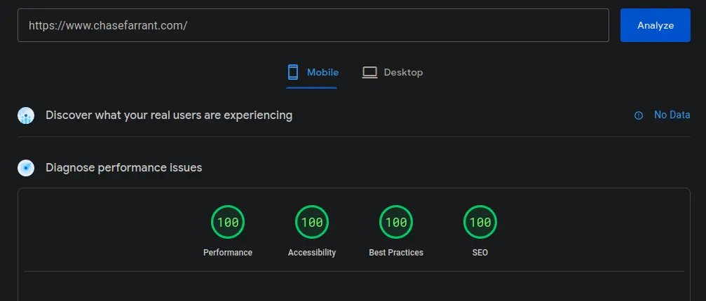

# {{ title }}
_Created on {{ page.date | asPostDate }}_

#### GitHub Source <a href="https://github.com/farrantch/chasefarrant.com" target="_blank" style="text-decoration:none">&#11016;</a>

&nbsp;
## Overview
Confession time... &nbsp; _I kinda loathe front-end web development._  &nbsp; Because of this, I have a huge soft spot for minimalist websites that convey information cleanly and concisely. Some famous examples include:
 - [https://motherfuckingwebsite.com](https://motherfuckingwebsite.com)
 - [https://berkshirehathaway.com](https://berkshirehathaway.com)
 - [https://www.vulfpeck.com](https://www.vulfpeck.com/)
 
 So, ideally, this website would be of a similar nature. I also wanted something super lightweight that I could easily stand up and maintain without worrying about the underlying framework getting in the way. I ended up stumbling upon the [eleventy](https://www.11ty.dev/) (11ty) framework, and it fits this niche perfectly.


&nbsp;
## Why Eleventy?
I love the simplicity of Markdown and wanted that to be the primary format - but Markdown alone isn't enough. 11ty allows you to use Markdown, Nunjucks, Handlebars, WebC, EJS, and raw HTML - all within the same template!

With the built-in functionality of multiple languages and frameworks, developers can structure their projects as they see fit and pull in data from various sources, e.g., JSON, YAML, or even external APIs. The hot-reload functionality allows you to quickly see changes in the browser without having to rebuild manually.

&nbsp;
## Plugins
Here are a few 11ty plugins that I enabled:
- __Favicon Generator__ - Automatically generates all the different favicons required to provide the best experience for all users.
- __Lazy Load Images__ - Inserts a blurry placeholder while images are still loading, providing a better user experience while the website is loading.

&nbsp;
## Cache Busting
I added a "cache buster" that generates a unique URL for static files. This functionality allows users to immediately see changes instead of waiting for the cache TTL to expire. During the build, it inserts a UNIX datetime as a query parameter to generate a unique URL for static files. This functionality is primarily used on the static css files:

```hbs
  eleventyConfig.addFilter("bust", (url) => {
    const [urlPart, paramPart] = url.split("?");
    const params = new URLSearchParams(paramPart || "");
    params.set("v", DateTime.local().toFormat("X"));
    return `${urlPart}?${params}`;
  });
```


Usage:

```html
<link href="{{ '/css/styles.css' | url | bust }}" rel="stylesheet" />
```

Output:
```html
<link href="/css/styles.css?v=1678309695" rel="stylesheet" />
```


&nbsp;
## Code Formatting
[prismjs](https://prismjs.com/) is used for code formatting. It uses the autoloader functionality to dynamically load languages, removing the need to download all possible language parsers.

```html
  <head>
  ...
    <script src="https://unpkg.com/prismjs@v1.x/components/prism-core.min.js"></script>
    <script src="https://unpkg.com/prismjs@v1.x/plugins/autoloader/prism-autoloader.min.js"></script>
  ...
  </head>
```

For the code formatting theme, I use a modified version of [VS Code Dark+](https://github.com/PrismJS/prism-themes/blob/master/themes/prism-vsc-dark-plus.css).

&nbsp;
## Architecture
The infrastructure is quite simple and deployed from a single CloudFormation template.
```
                      ┌────────────┐
                      │            │
                      │  ACM Cert  │
                      │            │
                      └────────────┘
                             ▲
                             │                           ┌────────────────────────┐
                             │                           │                        │
                                        ┌───► http ────► │ S3 (redirect to https) │
┌────────────┐        ┌────────────┐    │                │                        │
│            │        │            │    │                └────────────────────────┘
│  Route 53  │ ─────► │ CloudFront ├────┤
│            │        │            │    │                ┌────────────────────────┐
└────────────┘        └────────────┘    │                │                        │
                                        └───► https ───► │          S3            │
                                                         │                        │
                                                         └────────────────────────┘
```
 There is also a separate CloudFormation template for CodePipeline that automatically deploys updates.

&nbsp;
## Fonts
Instead of external links to Google Fonts, I downloaded the fonts locally using [this](https://www.reddit.com/r/webdev/comments/sfnk0l/ive_seen_a_number_posts_about_improving_page/) guide and the [google-webfonts-helper](https://gwfh.mranftl.com/fonts) tool.

  - Headings - _Quicksand_
  - Body - _Noto Sans_
  - Code - _Jetbrains Mono_

 Doing this reduces the number of API calls to external URLs and improves performance.

&nbsp;
## Colors:
  -  #1B1B1B
  -  #E6AF2E
  -  #4F9D69
  -  #F27059
  -  #7EBDC3
  -  #E0E2DB

&nbsp;
## Performance
With these tweaks, the site easily achieves a rating of 100/100 on all metrics in Google Pagespeed:




&nbsp;